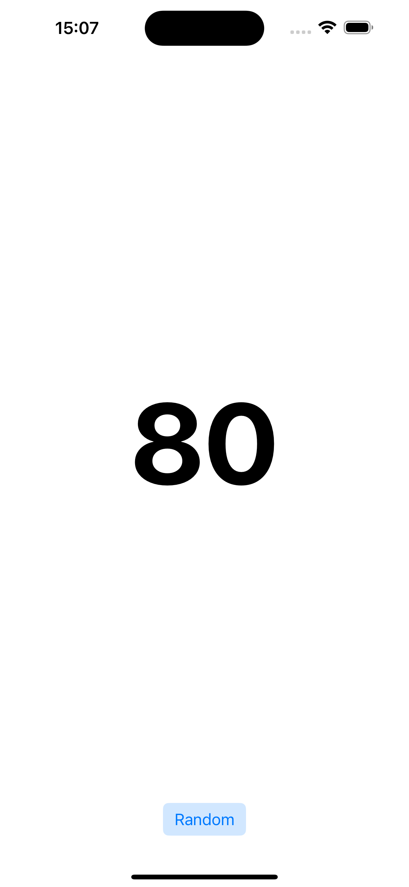

# Counter App

This is a simple random app built with MVVM.

# Screen


# MVVM - Architecture

```mermaid
graph TD;
    A -->|actions| B
    B -->|fetches Data| D[API Service]
    D -->|returns| C[Model: RandomQuote]
    C -->|encodes/decodes| B[ViewModel: RandomQuoteViewModel]
    B -->|notifies| A[View: RandomQuoteViewController]
